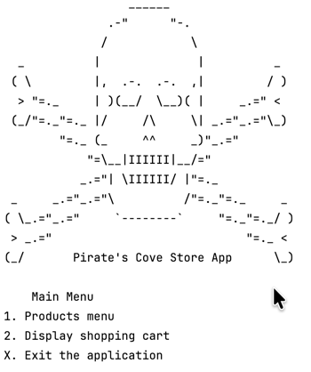

# Pirate's Cove Store App

## Description
This is a simple CLI app to demonstrate techniques for constructing
a menu system, file I/O, and basic manipulation of collections.

## Running the Code  
The easiest way to run the code is to load it into IntelliJ IDEA and run the Main class.

## Code I'm Most Proud of
I'm particularly proud of the methods that handle the menu system.  
They handle going into submenus and coming back out, but are still simple and elegant.

For example:
```java
        boolean running = true;
        do {
            System.out.print(prompt);
            String userInput = scanner.nextLine();

            switch (userInput) {
                case "1":
                    productsMenu();
                    break;
                case "2":
                    displayCart();
                    break;
                case "X":
                    running = false;
                    break;
                default:
                    System.err.println("Invalid input.  Please try again.");
            }
        } while (running);
    }
```

I also think the ASCII art splash screen is pretty cool:



## My Personal Challenges
I struggled a bit figuring out how to effectively use collections.  
At one point, items would disappear from the cart like burried treasure 😅.  
My instructor was a real jerk about helping me, and I admit, I cried and screamed a bit.  
Then I realized that I didn't have to use an index to access the items in the cart, and it was very satisfying to see it work.

## Next Time...
I also learned that I should think through the project a bit more before I start coding, and that I should do the code in "baby steps".
I'm going to try to do that next time.